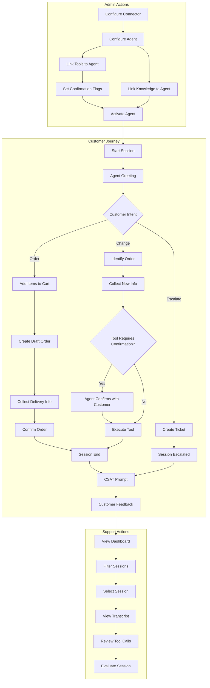

# Model Guide v0.1: Use Cases & Flows

---

## Personas

### 1. Admin
- Configures the system: connectors, agents, knowledge base
- Links tools to agents
- Manages users and API keys
- Views analytics and usage metrics
- Full access to all features

### 2. Support
- Reviews sessions and transcripts
- Filters and searches sessions
- Evaluates agent performance (internal feedback)
- Views analytics (read-only)
- Cannot configure agents or connectors

### 3. Customer
- End user interacting with voice/text agent
- Places orders, asks questions, requests changes
- Can escalate to human support
- Provides CSAT feedback after session

---

## Use Cases & Flows

### UC-01: Admin Configures a Connector

**Actor:** Admin

**Preconditions:** Admin is logged in

**Flow:**
1. Admin navigates to Connectors section
2. Admin selects a connector from catalog (e.g., "Shopify", "Zendesk")
3. System displays required configuration fields (from `connectors.config_schema`)
4. Admin enters connection details (API endpoint, etc.)
5. Admin creates or selects a secret for credentials
6. Admin saves the connector tool
7. System validates connection (optional health check)
8. Connector tool is now available for agents

**Entities Involved:**
- `connectors` (catalog)
- `connector_tools` (instance)
- `secrets`

---

### UC-02: Admin Configures an Agent

**Actor:** Admin

**Preconditions:** Admin is logged in

**Flow:**
1. Admin navigates to Agents section
2. Admin clicks "Create Agent"
3. Admin enters basic info (name, description)
4. Admin selects agent type (text/voice/multimodal)
5. Admin configures persona (name, personality description)
6. Admin writes system prompt and greeting message
7. Admin selects LLM provider and model
8. If voice: Admin selects voice provider, voice ID, STT provider
9. Admin configures language settings
10. Admin saves agent (inactive by default)
11. Admin activates agent when ready

**Entities Involved:**
- `agents`

---

### UC-03: Admin Links Tools to Agent

**Actor:** Admin

**Preconditions:** Agent exists, Connector tools exist

**Flow:**
1. Admin opens agent configuration
2. Admin navigates to "Tools" tab
3. System displays available connector tools for the organization
4. Admin selects tools to enable for this agent
5. Admin optionally sets per-tool configuration:
   - `config_overrides` - Custom parameters
   - `requires_confirmation` - Agent must confirm with user before executing
6. Admin saves tool assignments

**Entities Involved:**
- `agents`
- `connector_tools`
- `agent_connector_tools`

---

### UC-04: Admin Links Knowledge Documents to Agent

**Actor:** Admin

**Preconditions:** Agent exists, Knowledge documents exist

**Flow:**
1. Admin opens agent configuration
2. Admin navigates to "Knowledge" tab
3. System displays available knowledge documents
4. Admin selects documents to enable for this agent
5. Admin saves assignments

**Entities Involved:**
- `agents`
- `knowledge_documents`
- `agent_knowledge_documents`

---

### UC-05: Customer Places Order via Voice Agent

**Actor:** Customer

**Preconditions:** Voice agent is active with ecommerce connector tools

**Flow:**

1. **Session Start**
   - Customer initiates voice call
   - System creates session (channel: voice, status: active)
   - Agent greets customer: "Hi, welcome to Pizza Palace! How can I help you today?"

2. **Add Items to Cart**
   - Customer: "I'd like to order a large pepperoni pizza"
   - Agent calls `add_to_cart` tool
     - Input: `{ "item": "pizza", "size": "large", "toppings": ["pepperoni"], "quantity": 1 }`
     - Output: `{ "cart_id": "cart_123", "item_id": "item_456", "subtotal": 18.99 }`
   - Agent: "I've added a large pepperoni pizza to your cart. That's $18.99. Would you like anything else?"
   
3. **Add More Items**
   - Customer: "Yes, add a 2-liter Coke and garlic bread"
   - Agent calls `add_to_cart` tool (Coke)
     - Input: `{ "cart_id": "cart_123", "item": "2-liter Coke", "quantity": 1 }`
     - Output: `{ "item_id": "item_457", "subtotal": 3.49 }`
   - Agent calls `add_to_cart` tool (garlic bread)
     - Input: `{ "cart_id": "cart_123", "item": "garlic bread", "quantity": 1 }`
     - Output: `{ "item_id": "item_458", "subtotal": 5.99 }`
   - Agent: "I've added a 2-liter Coke and garlic bread. Your cart total is now $28.47. Anything else?"

4. **Review Cart**
   - Customer: "No, that's it"
   - Agent calls `get_cart` tool
     - Input: `{ "cart_id": "cart_123" }`
     - Output: `{ "items": [...], "subtotal": 28.47, "tax": 2.28, "total": 30.75 }`
   - Agent: "Let me confirm your order: one large pepperoni pizza, a 2-liter Coke, and garlic bread. Your total is $30.75 including tax. Should I place this order?"

5. **Create Draft Order**
   - Customer: "Yes"
   - Agent calls `create_draft_order` tool
     - Input: `{ "cart_id": "cart_123" }`
     - Output: `{ "draft_order_id": "draft_789", "status": "draft" }`

6. **Collect Delivery Info**
   - Agent: "Great! Is this for delivery or pickup?"
   - Customer: "Delivery"
   - Agent: "What's the delivery address?"
   - Customer: "123 Main Street, Apartment 4B"
   - Agent calls `set_delivery_address` tool
     - Input: `{ "draft_order_id": "draft_789", "address": "123 Main Street, Apt 4B" }`
     - Output: `{ "delivery_fee": 3.99, "estimated_time": "30-40 minutes" }`
   - Agent: "Delivery to 123 Main Street, Apartment 4B. There's a $3.99 delivery fee, and estimated arrival is 30-40 minutes. Your new total is $34.74."

7. **Confirm Order**
   - Agent: "Would you like to confirm this order?"
   - Customer: "Yes, confirm it"
   - Agent calls `confirm_order` tool
     - Input: `{ "draft_order_id": "draft_789" }`
     - Output: `{ "order_id": "ORD-2024-1234", "status": "confirmed", "estimated_delivery": "7:45 PM" }`
   - Agent: "Your order is confirmed! Your order number is ORD-2024-1234. It should arrive by 7:45 PM. Is there anything else I can help with?"

8. **Session End**
   - Customer: "No, thanks"
   - Agent: "Thank you for ordering from Pizza Palace! Enjoy your meal. Goodbye!"
   - Session ends (status: completed)
   - CSAT prompt triggered

**Entities Involved:**
- `sessions`
- `session_messages` (12+ messages in this flow)
- `connector_tools` (add_to_cart, get_cart, create_draft_order, set_delivery_address, confirm_order)
- `agent_connector_tools`

**Tool Calls Summary:**
| Tool | Confirmation Required | Notes |
|------|----------------------|-------|
| add_to_cart | No | Low risk, easily reversible |
| get_cart | No | Read-only |
| create_draft_order | No | Still a draft, not charged |
| set_delivery_address | No | Can be changed |
| confirm_order | Yes (implicit) | Agent verbally confirms before calling |

---

### UC-06: Customer Changes Delivery Address

**Actor:** Customer

**Preconditions:** Customer has existing confirmed order

**Flow:**

1. **Session Start**
   - Customer initiates voice call
   - System creates session (channel: voice)
   - Agent: "Hi, welcome to Pizza Palace! How can I help you?"

2. **Identify Order**
   - Customer: "I need to change my delivery address for order ORD-2024-1234"
   - Agent calls `get_order` tool
     - Input: `{ "order_id": "ORD-2024-1234" }`
     - Output: `{ "order_id": "ORD-2024-1234", "status": "preparing", "address": "123 Main Street, Apt 4B", "items": [...] }`
   - Agent: "I found your order. It's currently being prepared for delivery to 123 Main Street, Apartment 4B. What's the new address?"

3. **Collect New Address**
   - Customer: "Change it to 456 Oak Avenue"
   - Agent stores new address in context (does NOT call tool yet)

4. **Confirmation Before Tool Call** ⚠️
   - Agent: "Just to confirm: you want to change the delivery address from 123 Main Street, Apartment 4B to 456 Oak Avenue. Is that correct?"
   - Customer: "Yes, that's right"

5. **Execute Tool with Confirmation**
   - Agent calls `update_order_address` tool (requires_confirmation: true)
     - Input: `{ "order_id": "ORD-2024-1234", "new_address": "456 Oak Avenue" }`
     - Output: `{ "success": true, "new_estimated_time": "35-45 minutes" }`
   - Agent: "Done! Your order will now be delivered to 456 Oak Avenue. The new estimated arrival time is 35-45 minutes. Is there anything else?"

6. **Session End**
   - Customer: "No, that's all"
   - Agent: "Great! Your pizza will be on its way soon. Goodbye!"
   - Session ends (status: completed)

**Entities Involved:**
- `sessions`
- `session_messages`
- `connector_tools` (get_order, update_order_address)
- `agent_connector_tools` (with requires_confirmation flag)

**Tool Confirmation Pattern:**

When `agent_connector_tools.requires_confirmation = true`:

```
┌─────────────────────────────────────────────────────────┐
│ Agent collects all required parameters                  │
│                      ↓                                  │
│ Agent summarizes the action to customer                 │
│ "I'm going to change your address to X. Is that right?"│
│                      ↓                                  │
│ Customer confirms: "Yes"                                │
│                      ↓                                  │
│ Agent executes tool                                     │
│                      ↓                                  │
│ Agent reports result                                    │
└─────────────────────────────────────────────────────────┘
```

**Tools Requiring Confirmation (Recommended):**
| Tool | Why |
|------|-----|
| update_order_address | Affects delivery |
| cancel_order | Irreversible |
| process_refund | Financial impact |
| update_account_info | Security sensitive |
| confirm_order | Financial commitment |
| delete_* anything | Destructive action |

**Tools NOT Requiring Confirmation:**
| Tool | Why |
|------|-----|
| get_* (read operations) | No side effects |
| add_to_cart | Easily reversible |
| search_* | No side effects |
| create_draft_* | Not committed yet |

---

### UC-07: Customer Escalates to Human Support

**Actor:** Customer

**Preconditions:** Session is active

**Flow:**
1. Customer is in active session with agent
2. Customer says "I want to speak to a human" or agent detects it cannot help
3. Agent acknowledges escalation request
4. Agent calls `create_ticket` tool (Zendesk connector)
5. Tool creates ticket with session context (transcript, order info)
   - Output: `{ "ticket_id": "ZD-5678", "ticket_url": "..." }`
6. Agent informs customer: "I've created a support ticket #ZD-5678. Someone will contact you within 2 hours."
7. Session ends (status: escalated, escalation_ref: "ZD-5678")

**Entities Involved:**
- `sessions` (status → escalated, escalation_ref → ticket ID)
- `session_messages`
- `connector_tools` (Zendesk)

---

### UC-08: Support Reviews Sessions Dashboard

**Actor:** Support

**Preconditions:** Support is logged in

**Flow:**
1. Support navigates to Sessions dashboard
2. System displays paginated list of sessions with:
   - Date/time
   - Agent name
   - Channel (voice/web/api)
   - Channel type icon
   - Status (active/completed/escalated/abandoned)
   - Duration (calculated)
   - User identifier
   - Feedback rating (if any)
3. Support can sort by date, duration, status
4. Support can search by user identifier or external ID

**Entities Involved:**
- `sessions`
- `agents`
- `session_feedback`

---

### UC-09: Support Filters Sessions

**Actor:** Support

**Preconditions:** Support is on Sessions dashboard

**Flow:**
1. Support applies filters:
   - **Channel type:** voice, web, api, slack, widget, sms, whatsapp
   - **Status:** active, completed, escalated, abandoned
   - **Agent:** specific agent or all
   - **Date range:** from/to
   - **Has feedback:** yes/no
   - **Feedback rating:** positive/negative
   - **Feedback source:** customer/support/all
2. System updates session list based on filters
3. Support can save filter presets (future feature)

**Entities Involved:**
- `sessions`
- `session_feedback`

---

### UC-10: Support Views Session Detail

**Actor:** Support

**Preconditions:** Support has selected a session

**Flow:**
1. Support clicks on a session row
2. System displays session detail view:
   - **Header:** Session ID, external_id, agent, channel_type, status, duration, timestamps
   - **Escalation:** If escalated, show escalation_ref with link to external ticket
   - **User Info:** user_identifier, user_metadata
   - **Transcript:** All session_messages in sequence
     - User messages (with audio player if voice)
     - Assistant messages (with audio player if voice)
     - Tool calls (expandable: show input/output, highlight if confirmation was required)
   - **Feedback:** Customer CSAT + Support evaluations (if any)
   - **Metadata:** Any custom metadata
3. Support can play back audio for voice sessions
4. Support can expand/collapse tool execution details
5. Tool calls that required confirmation are visually marked

**Entities Involved:**
- `sessions`
- `session_messages`
- `session_feedback`

---

### UC-11: Support Evaluates Agent Performance

**Actor:** Support

**Preconditions:** Support is viewing session detail

**Flow:**
1. Support reviews transcript and tool usage
2. Support clicks "Evaluate Session"
3. Support selects rating: thumbs up (2) or thumbs down (1)
4. Support optionally adds comment explaining evaluation
5. Support optionally selects tags: "wrong_tool", "poor_tone", "hallucination", "missed_intent", "good_resolution"
6. Support saves evaluation
7. Evaluation stored as session_feedback with:
   - feedback_source: support
   - feedback_ref: support user ID

**Entities Involved:**
- `session_feedback`
- `users` (support user)

---

### UC-12: Customer Provides CSAT Feedback

**Actor:** Customer

**Preconditions:** Session has ended

**Flow:**
1. After session ends, system prompts for feedback
   - Voice: "How would you rate this interaction? Press 1 for poor, 2 for good"
   - Text: Displays thumbs up/down buttons or 1-5 stars
2. Customer provides rating
3. System optionally asks: "Any comments?" (voice: speech-to-text)
4. Feedback stored with:
   - feedback_source: customer
   - feedback_ref: null or external customer ID

**Entities Involved:**
- `session_feedback`

---

### UC-13: Admin/Support Views Analytics

**Actor:** Admin or Support

**Preconditions:** User is logged in

**Flow:**
1. User navigates to Analytics dashboard
2. System displays key metrics:
   - **Volume:** Total sessions, by channel_type, by agent
   - **Resolution Rate:** completed / (completed + escalated + abandoned)
   - **Escalation Rate:** escalated / total
   - **Abandonment Rate:** abandoned / total
   - **Avg Session Duration** (calculated from timestamps)
   - **CSAT Score:** Avg customer rating (feedback_source: customer)
   - **Agent Evaluation Score:** Avg support rating (feedback_source: support)
3. User can filter by date range, agent, channel_type
4. User can view trends over time (charts)

**Entities Involved:**
- `sessions` (aggregated)
- `session_feedback` (aggregated, grouped by feedback_source)

---

## Schema Updates

### 1. session_feedback (Updated)

| Field | Type | Description |
|-------|------|-------------|
| id | UUID | Primary key |
| session_id | UUID | FK → sessions |
| message_id | UUID | FK → session_messages (optional) |
| rating | INTEGER | 1 = negative, 2 = positive |
| comment | TEXT | Optional feedback text |
| feedback_source | VARCHAR | customer, support, system |
| feedback_ref | VARCHAR | External reference (support user ID, customer ID, etc.) |
| feedback_tags | ARRAY | Issue/quality tags |
| user_identifier | VARCHAR | Who gave feedback (for customer) |
| created_at | TIMESTAMP | |

**feedback_source enum:**
- `customer` - End user CSAT
- `support` - Internal quality evaluation
- `system` - Automated evaluation (V2)

**feedback_tags examples:**
- Negative: `wrong_tool`, `poor_tone`, `hallucination`, `missed_intent`, `slow_response`, `failed_tool`
- Positive: `good_resolution`, `efficient`, `polite`, `correct_tool_usage`

---

### 2. sessions (Updated)

| Field | Type | Description |
|-------|------|-------------|
| id | UUID | Primary key |
| organization_id | UUID | FK → organizations |
| agent_id | UUID | FK → agents |
| external_id | VARCHAR | Your system's session ID |
| channel_type | VARCHAR | voice, web, api, slack, widget, sms, whatsapp |
| user_identifier | VARCHAR | External user ID or token |
| user_metadata | JSONB | User context |
| status | VARCHAR | active, completed, escalated, abandoned |
| escalation_ref | VARCHAR | External ticket ID (Zendesk, etc.) |
| started_at | TIMESTAMP | |
| ended_at | TIMESTAMP | |
| metadata | JSONB | |

**channel_type enum:**
- `voice` - Phone/voice call
- `web` - Web chat widget
- `api` - Direct API integration
- `slack` - Slack bot
- `widget` - Embedded widget
- `sms` - SMS (V2)
- `whatsapp` - WhatsApp (V2)
- `email` - Email (V2)

---

### 3. agent_connector_tools (Updated)

| Field | Type | Description |
|-------|------|-------------|
| id | UUID | Primary key |
| agent_id | UUID | FK → agents |
| connector_tool_id | UUID | FK → connector_tools |
| is_enabled | BOOLEAN | |
| config_overrides | JSONB | Override default config |
| requires_confirmation | BOOLEAN | Agent must confirm with user before executing |
| created_at | TIMESTAMP | |

---

## Personas × Permissions Matrix

| Feature | Admin | Support | Customer |
|---------|-------|---------|----------|
| Configure connectors | ✅ | ❌ | ❌ |
| Configure agents | ✅ | ❌ | ❌ |
| Link tools to agents | ✅ | ❌ | ❌ |
| Set tool confirmation flag | ✅ | ❌ | ❌ |
| Manage knowledge docs | ✅ | ❌ | ❌ |
| Manage users | ✅ | ❌ | ❌ |
| Manage API keys | ✅ | ❌ | ❌ |
| View sessions list | ✅ | ✅ | ❌ |
| View session detail | ✅ | ✅ | ❌ |
| Filter sessions | ✅ | ✅ | ❌ |
| Evaluate sessions | ✅ | ✅ | ❌ |
| View analytics | ✅ | ✅ (read-only) | ❌ |
| Interact with agent | ❌ | ❌ | ✅ |
| Provide CSAT | ❌ | ❌ | ✅ |
| Escalate to human | ❌ | ❌ | ✅ |

---

## Flow Diagram


