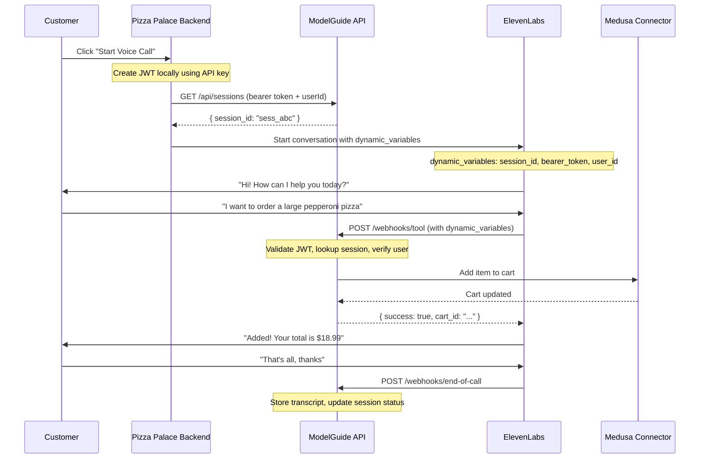

# ElevenLabs Agent Integration Plan

## Architecture Overview




## Client Integration Flow

### Step 1: Client Creates JWT Locally (No API Call)

```typescript
// Pizza Palace backend - using standard JWT library
import jwt from 'jsonwebtoken';

const apiKey = process.env.MODELGUIDE_API_KEY; // 'mgk_xxx...'

// Create JWT signed with API key (or secret derived from it)
const bearerToken = jwt.sign(
  { 
    iss: 'pizza-palace',  // issuer claim
    iat: Date.now() / 1000 
  },
  apiKey,  // sign with API key
  { expiresIn: '2h' }
);
```

### Step 2: Client Gets/Creates Session via ModelGuide API

```typescript
const userId = currentUser.id;  // Pizza Palace's customer ID

const response = await fetch('https://api.modelguide.com/api/sessions', {
  method: 'GET',  // or POST to create
  headers: {
    'Authorization': `Bearer ${bearerToken}`
  },
  body: JSON.stringify({ user_id: userId })
});

const { session_id } = await response.json();
```

### Step 3: Client Starts ElevenLabs Call with All Context

```typescript
await elevenlabs.conversations.create({
  agent_id: "pizza_palace_agent",
  dynamic_variables: {
    mg_session_id: session_id,
    mg_bearer_token: bearerToken,
    mg_user_id: userId
  }
});
```

## Implementation

### 1. Session API Endpoint

New endpoint: `GET /api/sessions`

```typescript
// modelguide-api/src/features/sessions/routes.ts

app.get('/api/sessions', jwtAuthMiddleware, async (c) => {
  const { user_id } = await c.req.json();
  const org = c.get('organization'); // from JWT validation
  
  // Find existing active session or create new one
  let session = await db.sessions.findActiveByUserId(org.id, user_id);
  
  if (!session) {
    session = await db.sessions.create({
      organization_id: org.id,
      user_identifier: user_id,
      channel_type: 'voice',
      status: 'active'
    });
  }
  
  return c.json({ session_id: session.id });
});
```

### 2. JWT Validation Middleware

```typescript
// modelguide-api/src/middleware/jwt-auth.ts

async function jwtAuthMiddleware(c, next) {
  const authHeader = c.req.header('Authorization');
  const token = authHeader?.replace('Bearer ', '');
  
  if (!token) {
    return c.json({ error: 'Missing token' }, 401);
  }
  
  // Find API key that can verify this JWT
  const apiKeys = await db.apiKeys.findAll();
  
  for (const apiKey of apiKeys) {
    try {
      const decoded = jwt.verify(token, apiKey.key_hash); // or original key
      const org = await db.organizations.findById(apiKey.organization_id);
      c.set('organization', org);
      c.set('apiKey', apiKey);
      return next();
    } catch (e) {
      continue; // try next key
    }
  }
  
  return c.json({ error: 'Invalid token' }, 401);
}
```

### 3. Webhook Endpoints (Hono)

Create new file: `modelguide-api/src/features/webhooks/elevenlabs.ts`

Two webhook endpoints:

- `POST /webhooks/elevenlabs/tool` - Handle tool calls during conversation
- `POST /webhooks/elevenlabs/end-of-call` - Handle end-of-call transcript

```typescript
// Key types
interface ElevenLabsToolCall {
  conversation_id: string;
  agent_id: string;
  tool_name: string;
  parameters: Record<string, unknown>;
  dynamic_variables: {
    mg_session_id: string;
    mg_bearer_token: string;
    mg_user_id: string;
  };
}

interface ElevenLabsEndOfCall {
  type: "post_call_transcription";
  data: {
    agent_id: string;
    conversation_id: string;
    transcript: Array<{ role: string; message: string; tool_calls: unknown }>;
    metadata: { call_duration_secs: number; /* ... */ };
    analysis: { call_successful: string; transcript_summary: string };
    conversation_initiation_client_data: {
      dynamic_variables: {
        mg_session_id: string;
        mg_bearer_token: string;
        mg_user_id: string;
      };
    };
  };
}
```

### 4. Tool Call Webhook Handler

```typescript
// POST /webhooks/elevenlabs/tool
app.post('/webhooks/elevenlabs/tool', async (c) => {
  const payload: ElevenLabsToolCall = await c.req.json();
  const { tool_name, parameters, dynamic_variables } = payload;
  const { mg_session_id, mg_bearer_token, mg_user_id } = dynamic_variables;
  
  // 1. Validate JWT
  const org = await validateJwt(mg_bearer_token);
  if (!org) {
    return c.json({ error: 'Invalid token' }, 401);
  }
  
  // 2. Lookup session
  const session = await db.sessions.findById(mg_session_id);
  if (!session || session.organization_id !== org.id) {
    return c.json({ error: 'Session not found' }, 404);
  }
  
  // 3. Verify user matches
  if (session.user_identifier !== mg_user_id) {
    return c.json({ error: 'User mismatch' }, 403);
  }
  
  // 4. Execute tool
  const result = await executeTool(tool_name, parameters, session);
  
  return c.json(result);
});
```

Tool router that maps tool names to connector actions:

```typescript
// Tool name format: {connector_slug}_{action}
// e.g., "medusa_add_to_cart" -> connector: medusa, action: add_to_cart

async function executeTool(toolName: string, params: unknown, session: Session) {
  const [connectorSlug, ...actionParts] = toolName.split('_');
  const action = actionParts.join('_');
  
  const connector = await db.connectors.findBySlug(connectorSlug, session.organization_id);
  const tool = await db.connectorTools.findBySlug(action, connector.id);
  
  // Execute via connector handler
  return connectorHandlers[connector.type].execute(tool, params, connector.config);
}
```

### 6. End-of-Call Webhook Handler

```typescript
// POST /webhooks/elevenlabs/end-of-call
app.post('/webhooks/elevenlabs/end-of-call', async (c) => {
  const payload: ElevenLabsEndOfCall = await c.req.json();
  
  if (payload.type !== 'post_call_transcription') {
    return c.json({ received: true });
  }
  
  const { conversation_id, transcript, metadata, analysis } = payload.data;
  const dynamicVars = payload.data.conversation_initiation_client_data?.dynamic_variables;
  
  if (!dynamicVars?.mg_session_id) {
    return c.json({ error: 'Missing session_id' }, 400);
  }
  
  // Validate JWT
  const org = await validateJwt(dynamicVars.mg_bearer_token);
  if (!org) {
    return c.json({ error: 'Invalid token' }, 401);
  }
  
  // Update session with transcript
  const session = await db.sessions.findById(dynamicVars.mg_session_id);
  
  // Store messages
  for (const msg of transcript) {
    await db.sessionMessages.create({
      session_id: session.id,
      role: msg.role === 'agent' ? 'assistant' : msg.role,
      content: msg.message,
      tool_calls: msg.tool_calls
    });
  }
  
  // Update session status
  await db.sessions.update(session.id, {
    status: 'completed',
    ended_at: new Date(),
    external_id: conversation_id,
    metadata: {
      call_duration_secs: metadata.call_duration_secs,
      transcript_summary: analysis.transcript_summary,
      call_successful: analysis.call_successful
    }
  });
  
  return c.json({ received: true });
});
```

### 7. Example Agent Prompt

Update the prompt to include tools section:

```markdown
# Tools

You have access to the following tools. Use them to help customers:

## medusa_add_to_cart
Add an item to the customer's shopping cart.
Parameters:
- item (required): Item name or description
- quantity (required): Number of items
- size (optional): Size variant (small, medium, large)
- toppings (optional): Array of toppings

## medusa_get_cart
View the current cart contents and total.

## medusa_confirm_order
Confirm and place the order. IMPORTANT: Always ask for customer confirmation before calling this.
Parameters:
- delivery_address (required): Full delivery address

## medusa_cancel_order
Cancel an existing order.
Parameters:
- order_id (required): The order ID to cancel
```

## Files to Create/Modify


| File                                                 | Action | Purpose                                  |
| ---------------------------------------------------- | ------ | ---------------------------------------- |
| `modelguide-api/src/features/sessions/routes.ts`     | Create | Session API endpoint (GET /api/sessions) |
| `modelguide-api/src/middleware/jwt-auth.ts`          | Create | JWT validation middleware                |
| `modelguide-api/src/features/webhooks/elevenlabs.ts` | Create | Tool call + end-of-call webhook handlers |
| `modelguide-api/src/features/webhooks/index.ts`      | Create | Export webhook router                    |
| `modelguide-api/src/app.ts`                          | Modify | Mount webhook routes at /webhooks        |
| `examples/elevenlabs-agent/`                         | Create | Example agent folder                     |
| `examples/elevenlabs-agent/prompt.md`                | Create | Agent prompt with tools section          |
| `examples/elevenlabs-agent/client-integration.ts`    | Create | Example client code showing full flow    |
| `examples/elevenlabs-agent/README.md`                | Create | Setup and integration guide              |


## Database Considerations

The existing schema supports this pattern:

- `sessions.external_id` - stores ElevenLabs `conversation_id` (set on end-of-call)
- `sessions.user_identifier` - stores customer ID (set when session created via API)
- `sessions.user_metadata` - stores customer name, etc.
- `sessions.metadata` - stores call analytics (duration, summary, etc.)
- `session_messages` - stores full transcript from end-of-call webhook

## Security Notes

1. **JWT Creation**: Client creates JWT locally using their API key - no round-trip to ModelGuide
2. **JWT Validation**: ModelGuide validates by trying to verify with known API keys
3. **Session Binding**: Session is tied to user_id at creation time, verified on each tool call
4. **Token Expiry**: JWT has 2h expiry, limiting exposure if leaked

